# University Department Information System (UDIS)

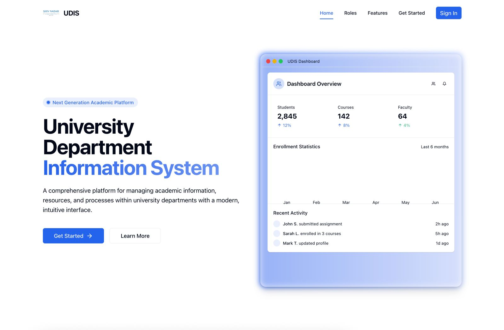

## Table of Contents
1. [Introduction](#introduction)
2. [Software Engineering Approach](#software-engineering-approach)
3. [System Architecture](#system-architecture)
4. [Features and Functionality](#features-and-functionality)
5. [Database Design](#database-design)
6. [User Roles](#user-roles)
7. [Installation and Setup](#installation-and-setup)
8. [Technology Stack](#technology-stack)
9. [Screenshots](#screenshots)
10. [Testing and Quality Assurance](#testing-and-quality-assurance)
11. [Challenges and Solutions](#challenges-and-solutions)

## Introduction

The University Department Information System (UDIS) is a comprehensive web application designed to streamline and digitize various academic and administrative processes within university departments. This system provides role-specific features for students, faculty members, department heads, and administrators, enhancing efficiency and collaboration across the institution.

The development of UDIS follows a systematic software engineering approach, guided by the Software Requirements Specification (SRS) document that outlines the functional and non-functional requirements, user stories, use cases, and system architecture.

## Software Engineering Approach

### Requirements Engineering

The project began with a thorough requirements gathering phase, documented in the [SRS Document](./SRSDocument.pdf). Key activities included:

- Stakeholder interviews with students, faculty, department heads, and administrators
- Analysis of existing manual processes and pain points
- Definition of functional and non-functional requirements
- Creation of user stories and acceptance criteria
- Prioritization of features using the MoSCoW method (Must-have, Should-have, Could-have, Won't-have)

### System Design

Following the requirements phase, a detailed system design was developed:

- **Architecture Design**: Adopted a client-server architecture with a React frontend and Flask backend
- **Database Design**: Created an entity-relationship diagram and normalized database schema
- **UI/UX Design**: Developed wireframes and mockups for each major feature
- **API Design**: Defined RESTful API endpoints and authentication mechanisms

### Development Methodology

The project followed an Agile development methodology:

- **Sprint Planning**: Features were broken down into manageable tasks and organized into 2-week sprints
- **Daily Stand-ups**: Regular communication to identify and resolve blockers
- **Continuous Integration**: Automated testing and deployment pipeline
- **Code Reviews**: Peer reviews for all code changes to maintain quality standards

### Quality Assurance

Multiple testing approaches were implemented to ensure system reliability:

- **Unit Testing**: Individual components tested in isolation
- **Integration Testing**: Verified that system components work together
- **End-to-End Testing**: Simulated real user scenarios
- **User Acceptance Testing**: Stakeholders validated that the system meets requirements

## System Architecture

UDIS is built using a modern client-server architecture:

```
┌─────────────────────┐     ┌─────────────────────┐     ┌─────────────────────┐
│                     │     │                     │     │                     │
│  Client Application │     │  Backend API        │     │  Database           │
│  (React + TypeScript)◄────►  (Flask + Python)   ◄────►  (SQLite/SQLAlchemy)│
│                     │     │                     │     │                     │
└─────────────────────┘     └─────────────────────┘     └─────────────────────┘
```

### Frontend Architecture

The React frontend follows a component-based architecture with:

- Context API for global state management
- Custom hooks for shared functionality
- Route-based code splitting for performance optimization
- Role-based access control for UI components

### Backend Architecture

The Flask backend implements:

- RESTful API endpoints
- JWT authentication and authorization
- SQLAlchemy ORM for database operations
- Modular structure with blueprint-based routing

## Features and Functionality

UDIS provides specialized features for different user roles:

### For Students
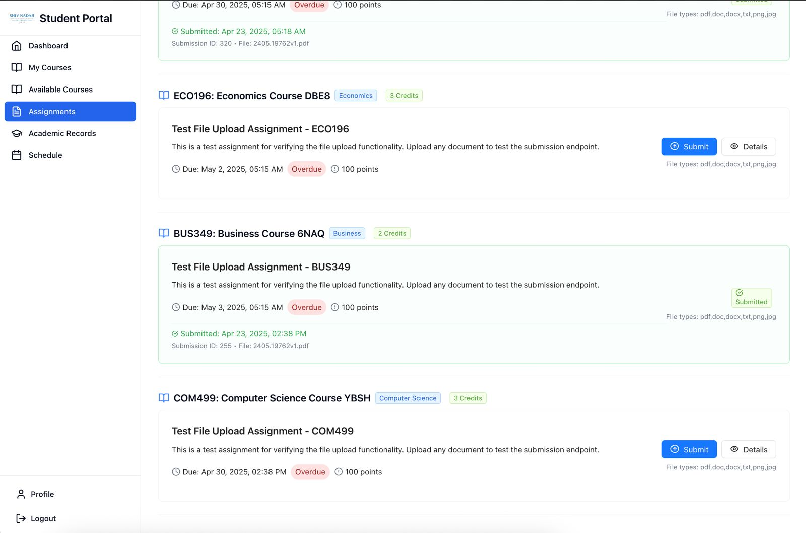

- Course registration and scheduling
- Assignment submission and tracking
- Grade visualization and analytics
- Academic record management
- Detailed assignment view with submission options
- 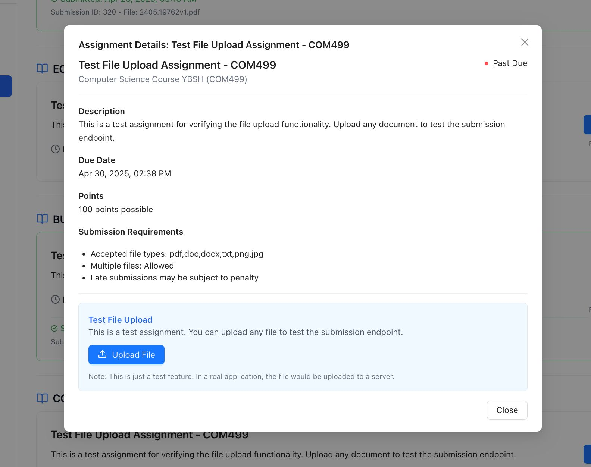

### For Faculty
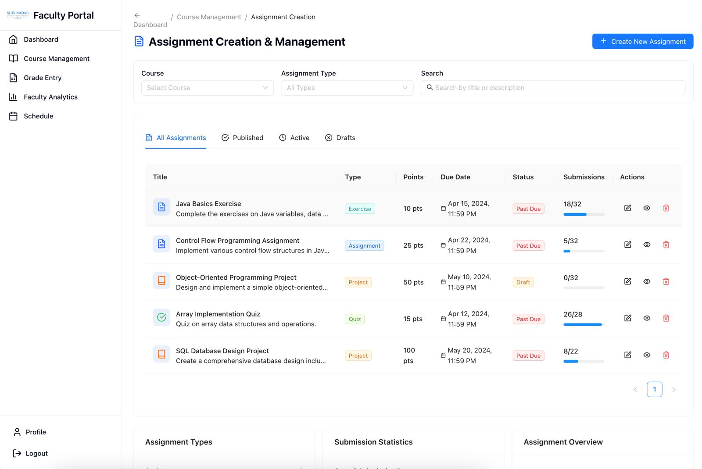

- Course management and content delivery
- Grading and assessment tools
- Student performance analytics
- Office hours and schedule management
- Assignment creation and management
- 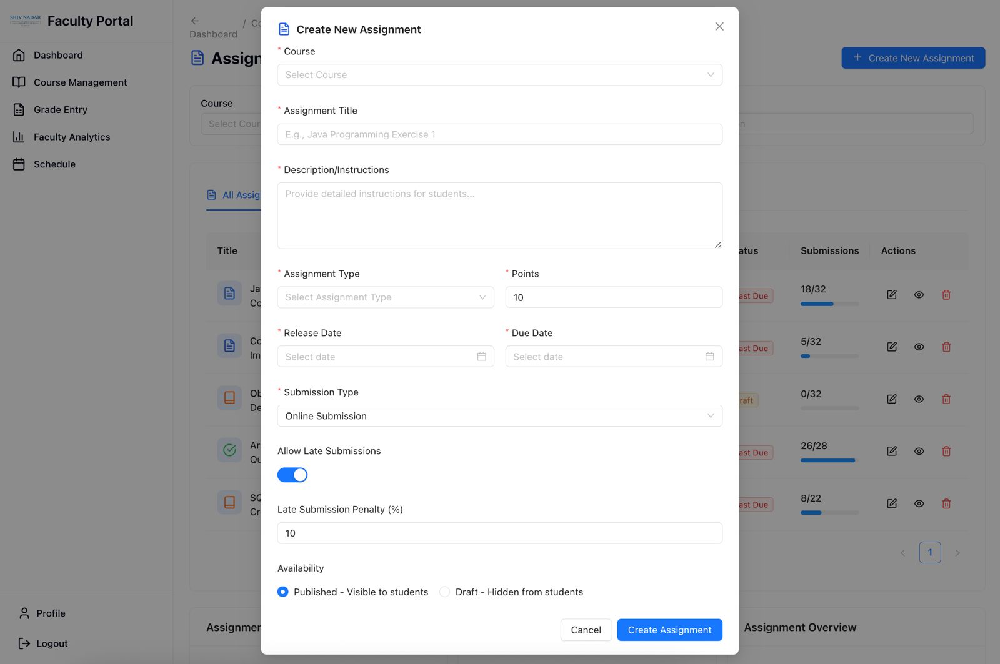
- Grade entry system
- 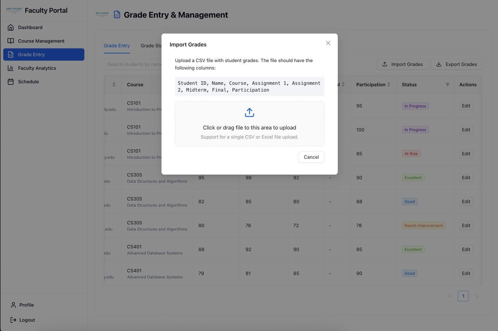

### For Department Heads
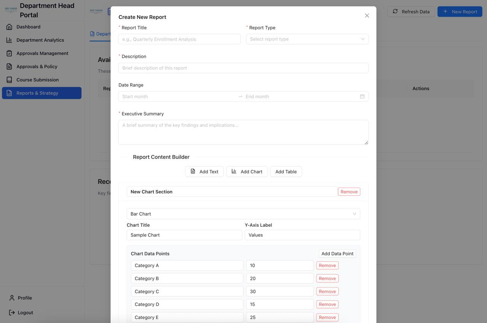

- Department-wide analytics and reports
- Faculty performance monitoring
- Resource approval and allocation
- Strategy planning and implementation
- Course request management
- 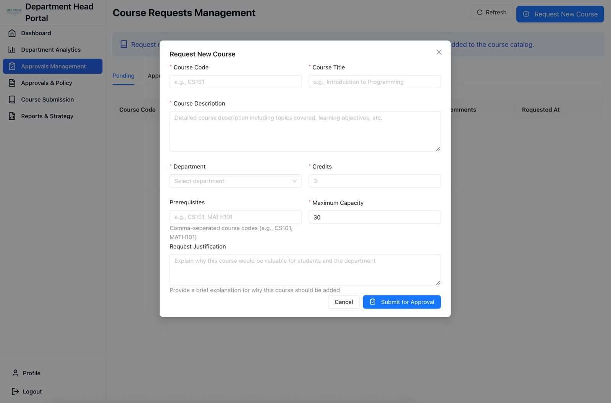

### For Administrators
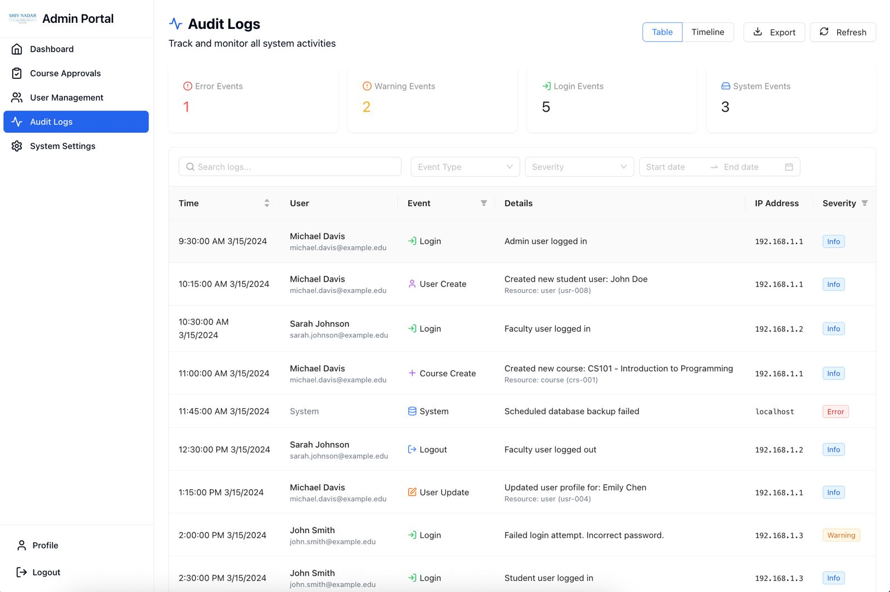

- User management and access control
- System configuration and settings
- Audit logs and system security
- Resource allocation and management

## Database Design

The database design follows a normalized schema with clear entity relationships:

### Core Entities
- **Users**: Base user information and authentication
- **Students**: Student-specific profile data
- **Faculty**: Faculty-specific profile and qualifications
- **DepartmentHeads**: Department head information
- **Courses**: Course details and metadata
- **Enrollments**: Student-course relationships
- **Assignments**: Task details and requirements
- **Submissions**: Student work submissions
- **Grades**: Performance assessments
- **Reports**: Analytical data for department oversight

### Key Relationships
- Users have role-specific profiles (Student, Faculty, DepartmentHead)
- Courses are created by Faculty and managed by DepartmentHeads
- Students enroll in Courses
- Faculty create Assignments for Courses
- Students submit Submissions for Assignments
- Faculty grade Submissions creating Grade records
- DepartmentHeads generate Reports based on aggregated data

## User Roles

UDIS implements a comprehensive role-based access control system:

### Student Role
- View and enroll in available courses
- Submit assignments and view grades
- Track academic progress
- Communicate with faculty

### Faculty Role
- Create and manage course content
- Create and grade assignments
- Generate performance reports
- Communicate with students

### Department Head Role
- Oversee department operations
- Approve course creations and changes
- Generate departmental reports
- Manage faculty assignments

### Administrator Role
- Manage user accounts
- Configure system settings
- Monitor system usage and security
- Allocate resources

## Installation and Setup

### Prerequisites
- Node.js 16+ and npm
- Python 3.9+
- pip package manager

### Frontend Setup
1. Clone the repository
2. Navigate to the project root directory
3. Install dependencies:
   ```
   npm install
   ```
4. Create `.env` file with required environment variables (see `.env.example`)
5. Start development server:
   ```
   npm run dev
   ```

### Backend Setup
1. Navigate to the Backend directory
2. Create and activate a virtual environment:
   ```
   python -m venv venv
   source venv/bin/activate  # On Windows: venv\Scripts\activate
   ```
3. Install dependencies:
   ```
   pip install -r requirements.txt
   ```
4. Configure environment variables in `.env`
5. Start the Flask server:
   ```
   python app.py
   ```

## Technology Stack

### Frontend
- **React**: UI component library
- **TypeScript**: Type-safe JavaScript
- **Tailwind CSS**: Utility-first CSS framework
- **Vite**: Build tool and development server
- **React Router**: Client-side routing
- **Zustand**: State management
- **Ant Design**: UI component library
- **Recharts**: Data visualization

### Backend
- **Flask**: Web framework
- **SQLAlchemy**: ORM for database operations
- **Flask-JWT-Extended**: Authentication and authorization
- **Flask-Migrate**: Database migration
- **SQLite**: Lightweight database
- **Python**: Programming language

### Testing
- **Jest**: JavaScript testing framework
- **React Testing Library**: React component testing
- **Pytest**: Python testing framework

## Screenshots

### Landing Pages

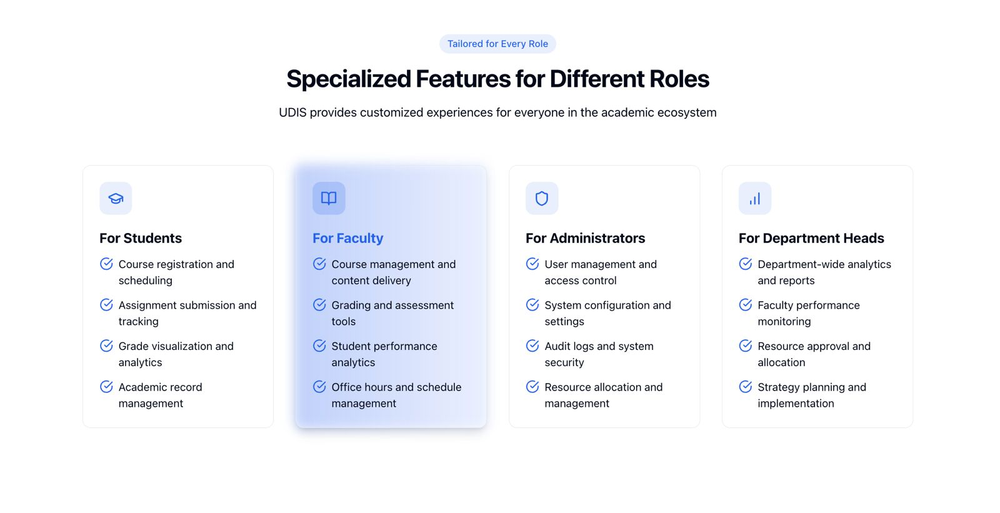
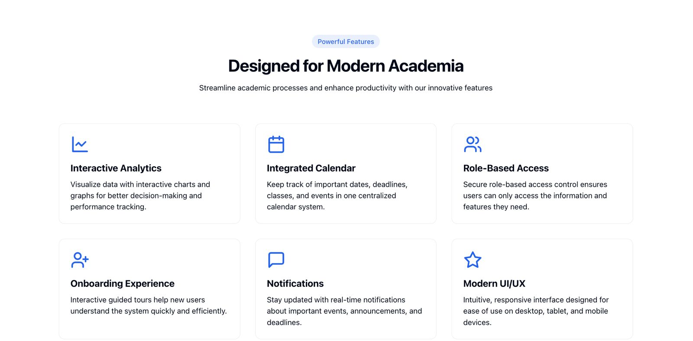

### Authentication
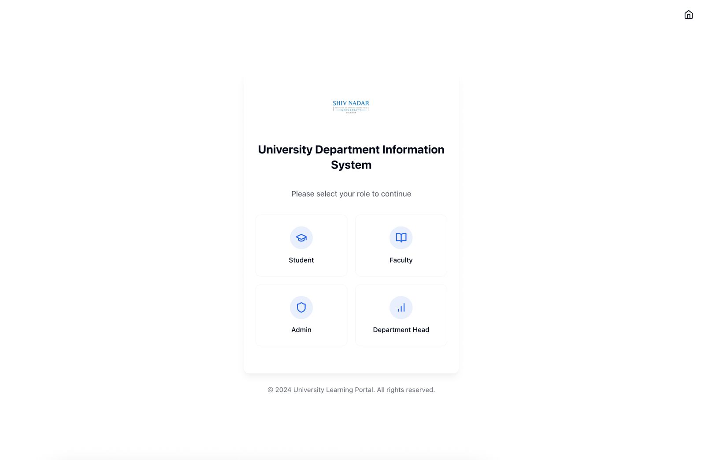

## Testing and Quality Assurance

The UDIS implementation includes comprehensive testing at multiple levels:

### Frontend Testing
- **Unit Tests**: Testing individual React components
- **Integration Tests**: Testing component interactions
- **End-to-End Tests**: Testing complete user flows

### Backend Testing
- **Unit Tests**: Testing individual route handlers and utilities
- **Integration Tests**: Testing API endpoints with database interactions
- **Security Tests**: Verifying authentication and authorization

### Continuous Integration
- Automated test execution on code commits
- Code quality checks and linting
- Build verification

## Challenges and Solutions

### Challenge: Complex Role-Based Access Control
**Solution**: Implemented a flexible permission system with JWT claims and context-based UI rendering

### Challenge: Data Consistency Across Multiple User Types
**Solution**: Centralized data models with clear relationships and validation rules

### Challenge: Responsive UI for Various Devices
**Solution**: Used Tailwind CSS and fluid design principles to ensure consistent experience across devices

### Challenge: Secure File Handling for Assignments
**Solution**: Implemented secure upload mechanisms with proper validation and sanitization

---

This project was developed as part of the software engineering course, implementing best practices in requirements gathering, design, implementation, and testing as outlined in the SRS document. 